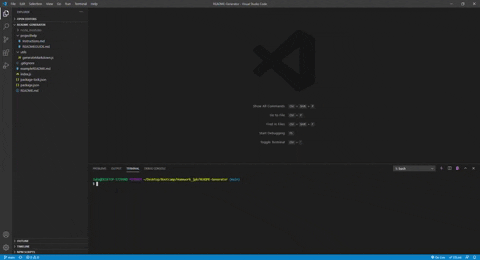

# Personal-README-Generator
  A CLI application utilizing node.js and inquirer to create simple, automated project README.md files. This is a version of my README Generator that creates README files with a personalized template for ease of use for myself.
   
  https://github.com/boxnbeeson/personal-rmg (application is ran through node, no deployable link to provide)
  ## <a name="toc">[Table of Contents]</a>
  * [Demo](#demo)
  * [Installation](#installation)
  * [Developer's Information](#devInfo)
  * [Credientials](#credientials)
  * [License](#license)
  
  ## Demo[Table of Contents](#toc)
  Once setup is complete, the user may simply run the program by typing 'node index.js' into the main folder's terminal. The user will be asked multiple questions regarding the project they are creating a README.md for. Once the program is out of questions, the README.md will be automatically generated, and can be adjusted to the user's preference. If you would like to follow my guide, you can view my tutorial [video](https://youtu.be/34QGRu6J9O0)
  
  ## <a name="installation">Installation</a>
  To install, the user will download the repository to their system. As the inquirer package is utilized, the user must start by installing this package (npm install inquirer). Once inquirer is finished installing into the program's folder, the user may run the program by typing 'node index.js'.
  ## Developer's Information
  Feel free to contact me using the information below if you have any questions or feedback!
   
  Name: Jacob Beeson
   
  [Portfolio](https://boxnbeeson.github.io/Portfolio/)
  [Github](https://github.com/boxnbeeson)
  <a href="mailto:john@example.com">John</a>
   
  Email: <beeson.jp@gmail.com>
  ## Credientials[Table of Contents](#toc)
  Understanding Node.js:
   
  [Node.js Documentation](https://nodejs.org/docs/latest/api/documentation.html)
   
  [Stackoverflow.com](https://stackoverflow.com/questions/2496710/writing-files-in-node-js)
   
  Markdown help:
   
  [Markdownguide.org](https://www.markdownguide.org/cheat-sheet/)
   
  [community.atlassian.com](https://community.atlassian.com/t5/Bitbucket-questions/How-to-write-a-table-of-contents-in-a-Readme-md/qaq-p/673363)
   
  [guides.github.com](https://guides.github.com/features/mastering-markdown/)
   
  Licenses:
   
  [https://choosealicense.com/](https://choosealicense.com/)
   
  Inquirer:
   
  [Inquirer Documentation](https://www.npmjs.com/package/inquirer)
  ## License
   MIT License
